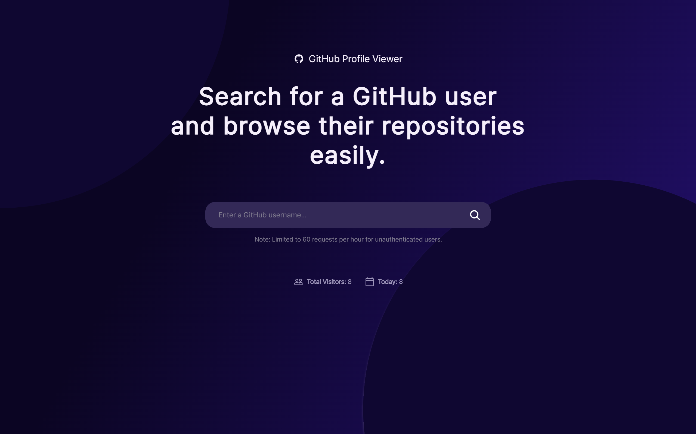
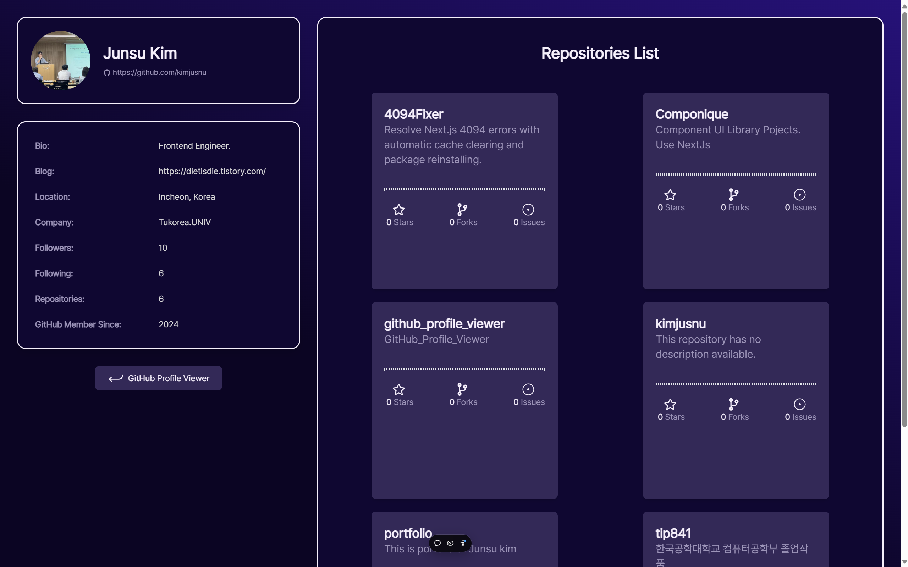

# 🧑‍💻GitHub Profile Viewer

**개발자:** 김준수 (한국공학대학교 컴퓨터공학부 소프트웨어전공)  
**디자이너:** 이혜원 (한국공학대학교 디자인공학부 산업디자인전공)

## 📝 프로젝트 소개

GitHub Profile Viewer는 GitHub 유저의 정보와 활동 내역을 한눈에 볼 수 있도록 돕는 웹 애플리케이션입니다. 사용자 이름만 입력하면 해당 유저의 프로필과 주요 레포지토리를 쉽고 빠르게 확인할 수 있습니다.

[프로젝트 GitHub 레포지토리](https://github.com/kimjusnu/github_profile_viewer)  
[GitHub Profile Viewer 기술블로그](https://dietisdie.tistory.com/category/%ED%94%84%EB%A1%9C%EC%A0%9D%ED%8A%B8/GitHub%20Profile%20Viewer)  
[배포 링크](https://github-profile-viewer-mu.vercel.app/)

---

## 🎨 디자인

  
_홈페이지 깃헙 유저 이름 검색_

  
_유저의 정보 프로필 및 레포지토리 정보_

---

## 🎥 동작 영상

  
_애플리케이션의 주요 기능을 보여주는 짧은 데모 영상입니다._

---

## 📋 개발 배경

많은 개발자들이 GitHub에 자신을 나타내는 프로필을 꾸미지만, 모든 사람이 프로필에 README 파일을 작성하지는 않습니다. 이럴 경우, 해당 사용자가 어떤 프로젝트를 하고 있는지 파악하기가 어려워요.  
그래서 **GitHub API**를 활용해 간편하게 유저 정보를 보여주고, 프로젝트와 활동 내역을 쉽게 확인할 수 있는 대시보드를 개발하게 되었습니다.

또한, 평소 제가 면접을 준비하면서 관심 있는 개발자의 프로젝트를 찾아보곤 했는데요. 매번 개별 레포지토리를 열어보는 게 번거롭더라고요. 그래서 **아이디만 입력하면 그 사람의 주요 정보**를 바로 확인할 수 있도록 접근성을 높여보고자 했어요.

---

## ⚙️ 주요 기능

- **유저 프로필 조회:** GitHub API를 통해 유저의 프로필 정보 확인
- **레포지토리 목록:** 프로젝트 목록과 별, 포크, 이슈 수 표시
- **검색 이력 저장:** Zustand로 최근 검색한 유저 기록 관리

---

## 🛠 사용 기술

- **Frontend:** React, Next.js, TailwindCSS
- **State Management:** Zustand
- **API 연동:** GitHub API 활용
- **배포:** Vercel

---

## 🗂 WBS (Work Breakdown Structure)

### 1️⃣ Day 1: 프로젝트 셋업 및 API 연동 작업

- Next.js와 TailwindCSS 설치
- GitHub API 호출 테스트
- 피그마를 통한 디자인 작업
- Main 웹 퍼블리싱 작업
- Zustand로 상태 관리 구현
- 유저 검색 기능 구현

### 2️⃣ Day 2: UI 구현 및 기능 개발

- Search 웹 퍼블리싱 작업
- 방문자 수 로컬스토리지에 저장하여 구현
- 레포지토리 카드 컴포넌트로 구현 후 map함수로 배열
- QA작업

### 3️⃣ Day 3: 배포와 데이터 시각화 마무리

- Vercel 배포
- GCP(Google Cloud Platform) 업로드
- SEO최적화
- 회고
- 기술블로그 작성

---

## 📈 배운 점과 부족한 부분들

이번 프로젝트를 진행하면서 여러 가지 기술과 개념을 접하게 되었고, 그 과정에서 저의 부족한 부분도 명확하게 알게 되었습니다. 이 프로젝트를 마무리한 후, 다음과 같은 주제들을 정리하여 **기술 블로그**에 포스팅할 계획입니다:

### ✨ 주요 배운 점 및 다룰 주제

1. **GitHub REST API 사용법**

   - GitHub API를 사용해 데이터를 어떻게 불러오고 활용할 수 있는지 이해했습니다.

2. **디자이너와 협업의 중요성**

   - 대학은 사회의 작은 축이라고 생각합니다. 다양한 전공의 학생들과 협업하며 서로의 역할을 이해하고 프로젝트를 진행하는 경험은, 사회에서 영업, 기획, PM, 디자이너, 개발자 등 다양한 부서와 협업하는 데 중요한 밑거름이 됩니다.
   - 이번 프로젝트는 **디자인과 학생과 협업**해 진행했으며, 이러한 협업 경험이 저의 강점이 될 것입니다.

3. **Next.js 설치 시 TurboPack 추가**

   - Next.js의 최신 기능인 TurboPack에 대해 이해하고 학습한 내용을 정리할 예정입니다.

4. **Next.js "use client" 지시어**

   - 클라이언트 컴포넌트와 서버 컴포넌트의 차이와 사용법을 깊이 이해했습니다.

5. **Next.js Image 최적화 라이브러리**

   - 이미지 최적화로 성능 개선을 경험하며 SEO에도 긍정적인 영향을 미친다는 것을 배웠습니다.

6. **fetch 사용법과 로딩 상태 관리**

   - `fetch`로 API를 호출하며 비동기 작업과 `setLoading(true)`로 로딩 상태를 관리했습니다.

7. **비동기 작업과 Promise, async/await**

   - 비동기 작업의 원리와 `Promise`와 `async/await`의 차이점을 이해하게 되었습니다.

8. **localStorage 활용법**

   - 방문자 수를 저장하고 로컬 스토리지를 사용하는 방법을 적용해보았습니다.

9. **CSS 속성: overflow-hidden, text-ellipsis, whitespace-nowrap**

   - 긴 텍스트를 깔끔하게 처리하기 위해 CSS로 텍스트를 한 줄에 고정하고 넘칠 때 "..."을 표시하는 방법을 익혔습니다.

10. **useRouter 사용법**

    - 페이지 간 이동과 동적 라우팅을 이해하며 `useRouter`의 유용성을 체험했습니다.

11. **GitHub Actions**

    - 자동화 배포를 설정하며 CI/CD 파이프라인의 기본 개념을 학습했습니다.

12. **Vercel 배포 자동화**

    - Vercel에서 Yarn 대신 NPM을 사용하는 이유와 자동화된 배포 프로세스를 경험했습니다.

13. **Axios 사용법**

    - Axios를 활용해 더 간편하게 API를 호출하고 에러 처리를 구현했습니다.

14. **반응형 웹 개발**
    - `<meta name="viewport" content="width=device-width, initial-scale=1.0" />`을 통해 반응형 웹사이트를 구현했습니다.

---

📧 **문의 및 피드백**  
더 궁금한 사항이 있다면 GitHub 이슈 또는 이메일을 통해 언제든지 연락 주시면 빠르게 회신 드리겠습니다! 😊
